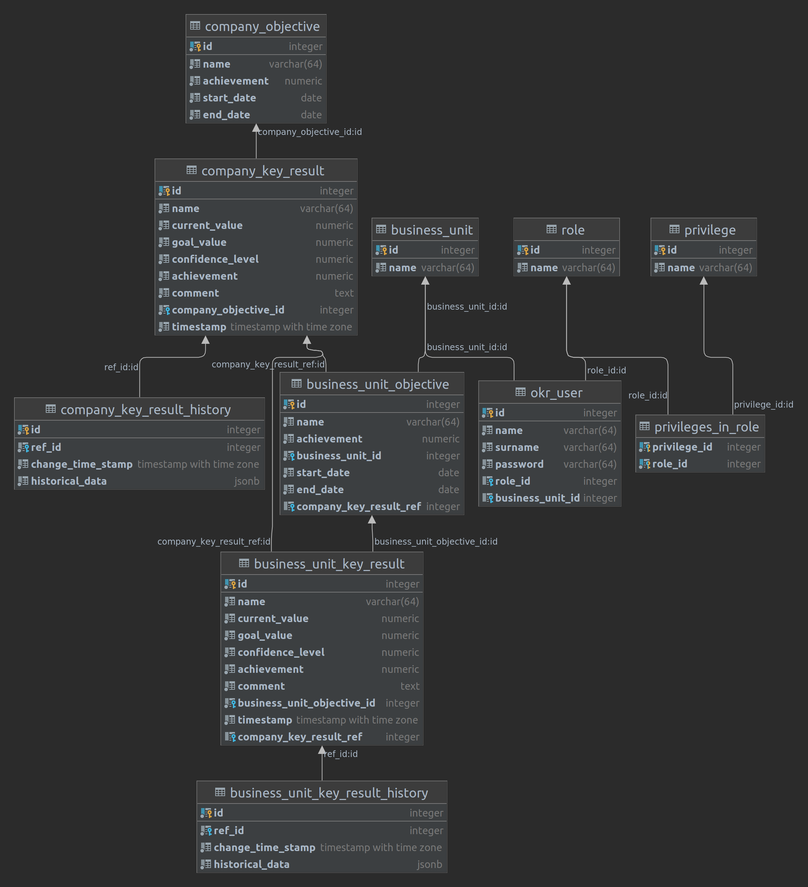

# Docker

This project contains a dockerfile in the docker directory.
Using this dockerfile ([reference](https://docs.docker.com/get-started/02_our_app/#build-the-apps-container-image))
a PostgreSql instance is started in docker. The `docker` schema of the
database contains the tables pictured in the following graphic:

# Database

The database mostly works by just CRUD'ing the data you want to work with.

For some tables there is some automation. For both of the *keyresult tables
the calculation of the achievment is automated.
For both of the *objective tables the calculation of the achievement is automated
using database triggers.
The *keyresulthistory is also generated using database triggers.